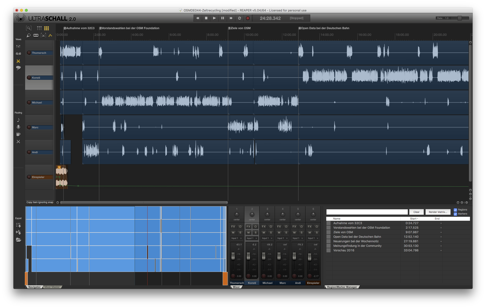

# OSMDE044

Workflow
* process `Recordings/*Sprecher X*.flac` with Auphonic Multitrack Desktop App (which export single track option)
* import  `Recordings/AuphonicMultitrack.track0*.flac` into Reaper
* fix audio mixing, remove noice Auphonic didn't catch/recognize/classifiy directly
* add Einspieler and Outro
* render single tracks into `rc1/`
* upload to Auphonic.com for final mixing, encoding in other formats and distribution to webserver

